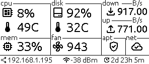
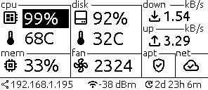

# SysInk

A high-performance, lightweight system monitor for Raspberry Pi with Waveshare e-Paper display, written in Zig.

## Features

- **Real-time Monitoring**: CPU load, temperature, memory usage, disk usage, fan speed.
- **Network Stats**: IP address, signal strength (WiFi), upload/download speeds.
- **System Info**: Uptime, APT updates availability, Internet connection status.
- **Optimized Rendering**: Partial updates for e-Paper display to minimize flickering and maximize refresh rate.
- **Standalone**: Statically linked binary, no external runtime dependencies (libc-free/musl).

## Screenshots

| Main Screen | Loading Screen |
|:-----------:|:--------------:|
|  |  |

| Sleep Screen | Threshold Alert |
|:------------:|:---------------:|
|  |  |

## Hardware Requirements

- **Raspberry Pi**: Tested on Pi 4 and Pi 5 (should work on others with GPIO header).
- **Display**: [Waveshare 2.9inch e-Paper Module (B/W) V2](https://www.waveshare.com/wiki/2.9inch_e-Paper_Module).
  - *Note: This project is specifically tuned for the V2 version of the display.*
- **Connections**: SPI interface and GPIO pins (RST, DC, BUSY, PWR).

## Development

You can develop and test the UI logic on a non-Raspberry Pi machine (e.g., x86_64 Linux) by using the BMP export feature. This allows you to visualize what would be sent to the display without the actual hardware.

1. **Build the project**:
   ```bash
   zig build
   ```

2. **Run with BMP export enabled**:
   ```bash
   EXPORT_BMP=true BMP_EXPORT_PATH=/tmp/display.bmp ./zig-out/bin/sys-ink
   ```

3. **View the output**:
   Open `/tmp/display.bmp` in an image viewer. It will update whenever the display would update.

## Project Structure

- `src/main.zig`: Entry point, signal handling, and main event loop.
- `src/scheduler.zig`: Task scheduler for periodic updates.
- `src/display_renderer.zig`: High-level rendering logic (drawing text, icons, graphs).
- `src/display_config.zig`: Layout constants and configuration.
- `src/system_ops.zig`: System metrics collection (CPU, RAM, Disk, etc.).
- `src/network_ops.zig`: Network status and traffic monitoring.
- `src/waveshare_epd/`: Low-level driver for the e-Paper display.
- `src/graphics.zig`: Bitmap drawing primitives.

## Build Instructions

### Prerequisites

- [Zig Compiler](https://ziglang.org/download/) (latest master or 0.12+)

### Building for Raspberry Pi (AArch64)

To build a minimal, statically linked binary for Raspberry Pi:

```bash
zig build -Dtarget=aarch64-linux-musl -Doptimize=ReleaseSmall
```

The resulting binary will be located at `zig-out/bin/sys-ink`.

## Installation

### Option A: Debian Package (Recommended)

1. **Download the `.deb` package** for your architecture (`arm64` for Pi 3/4/5, `armhf` for Pi Zero/2) from the [Releases](https://github.com/yourusername/sys-ink/releases) page.
2. **Install**:
   ```bash
   sudo dpkg -i sys-ink_*.deb
   ```
   The service will start automatically.

### Option B: Manual Binary Installation

1. **Download the binary** (`sys-ink-aarch64` or `sys-ink-armhf`) from the Releases page.
2. **Transfer to Raspberry Pi**:
   ```bash
   scp sys-ink-aarch64 user@raspberrypi:/usr/local/bin/sys-ink
   ```
3. **Set Permissions**:
   ```bash
   ssh user@raspberrypi
   sudo chmod +x /usr/local/bin/sys-ink
   ```
   Ensure the user running the application is in `gpio` and `spi` groups.

### Systemd Service (Manual Install Only)

If you installed manually (Option B), create a service file:

`/etc/systemd/system/sys-ink.service`:

```ini
[Unit]
Description=SysInk Service
After=network.target

[Service]
ExecStart=/usr/local/bin/sys-ink
Restart=always
User=root
Environment=LOG_LEVEL=INFO

[Install]
WantedBy=multi-user.target
```

Enable and start the service:

```bash
sudo systemctl enable --now sys-ink
```

## Configuration

The application is configured via environment variables. You can set these in the systemd service file or export them before running.

| Variable | Default | Description |
|----------|---------|-------------|
| `GPIO_CHIP` | `/dev/gpiochip0` | Path to GPIO chip device (check with `gpiodetect`) |
| `LOG_LEVEL` | `INFO` | Logging level (DEBUG, INFO, WARN, ERROR) |
| `THRESHOLD_CPU_CRITICAL` | `90` | CPU load critical threshold (%) |
| `THRESHOLD_TEMP_CRITICAL` | `85` | CPU temperature critical threshold (°C) |
| `THRESHOLD_DISK_CRITICAL` | `95` | Disk usage critical threshold (%) |
| `EXPORT_BMP` | `false` | Enable BMP export for web debugging |
| `BMP_EXPORT_PATH` | `/tmp/sys-ink.bmp` | Path for exported BMP |

## Troubleshooting

### "Failed to initialize display"
- Ensure SPI is enabled (`sudo raspi-config` -> Interface Options -> SPI).
- Check wiring connections.
- Verify the user has permissions to access `/dev/spidev0.0` and `/dev/gpiochip*`.
  - Add user to groups: `sudo usermod -a -G spi,gpio <username>`

### Display not updating or showing garbage
- Ensure you have the **V2** version of the Waveshare 2.9" display. V1 uses different LUTs and commands.
- Check if the display is correctly seated in the HAT or if wires are loose.

### "Memory leak detected on exit!"
- This is a warning from the Zig GeneralPurposeAllocator in debug/release-safe modes. It usually indicates a clean shutdown didn't happen (e.g., `kill -9`). Use `Ctrl+C` or `SIGINT` for a graceful shutdown.

## License

MIT
