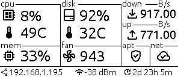
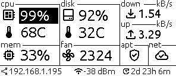

# SysInk

A lightweight system monitor for Raspberry Pi with Waveshare e-Paper display, written in Zig.

## Features

- **Real-time Monitoring**: CPU load, temperature, memory usage, disk usage, fan speed.
- **Network Stats**: IP address, signal strength (WiFi), upload/download speeds.
- **System Info**: Uptime, APT updates availability, Internet connection status.
- **Hardware Health**: Under-voltage and NVMe SMART critical warnings — shown as an
  inverted status bar on the panel and published over MQTT as problem entities.
- **Optimized Rendering**: Partial updates for e-Paper display to minimize flickering and maximize refresh rate.
- **Home Assistant**: Optional MQTT publishing with auto-discovery.
- **Standalone**: Statically linked binary (using musl), easy to deploy on any distro.

## Screenshots

| Main Screen | Loading Screen |
|:-----------:|:--------------:|
|  |  |

| Sleep Screen | Threshold Alert |
|:------------:|:---------------:|
|  |  |

## Hardware Requirements

- **Raspberry Pi**: Tested on Pi 5; uses the modern Linux GPIO character device
  API (`/dev/gpiochip*`), including the Pi 5's RP1 chip. Older models may work —
  `armhf` builds are published — but are untested.
- **Display**: [Waveshare 2.9inch e-Paper Module (B/W) V2](https://www.waveshare.com/wiki/2.9inch_e-Paper_Module).
  - *Note: This project is specifically tuned for the V2 version of the display.*
- **Connections**: SPI interface and GPIO pins (RST, DC, BUSY, PWR).

## Development

You can develop and test the UI logic on a non-Raspberry Pi machine (e.g., x86_64 Linux) by using the BMP export feature. This allows you to visualize what would be sent to the display without the actual hardware.

1. **Build the project**:
   ```bash
   zig build
   ```

2. **Run with BMP export enabled**:
   ```bash
   EXPORT_BMP=true BMP_EXPORT_PATH=/tmp/display.bmp ./zig-out/bin/sys-ink
   ```

3. **View the output**:
   Open `/tmp/display.bmp` in an image viewer. It will update whenever the display would update.

### Tests

Parsing, layout, rendering, the panel driver and the MQTT protocol are covered
by unit tests that run on any host — the driver and renderer are generic over
their transport, so their command sequences are checked against a recorder
rather than a panel:

```bash
zig build test --summary all
```

The remaining hardware-facing modules only compile for Linux, so they are
type-checked separately:

```bash
zig build check
```

The renderer has a golden-image test: it draws a screen with fixed values and
compares the packed frame against `src/testdata/golden_main.bin`, which pins the
whole layout at once. After an intentional layout change, regenerate it and
review the diff:

```bash
zig build golden
```

### Regenerating fonts

`src/font_data.zig` is generated by `tools/fontgen.c` (needs cairo and freetype2).
Glyph bitmaps depend on the installed cairo/FreeType versions, and the layout
constants in `src/display_config.zig` are tuned to the checked-in output — diff
carefully before committing a regenerated file.

```bash
gcc -o fontgen $(pkg-config --cflags cairo freetype2) tools/fontgen.c $(pkg-config --libs cairo freetype2) -lm
./fontgen   # writes src/font_data.zig
```

## Project Structure

- `src/main.zig`: Entry point, signal handling, scheduled tasks, main event loop.
- `src/scheduler.zig`: Monotonic-clock task scheduler for periodic updates.
- `src/parse.zig`: I/O-free parsers for procfs/sysfs and command output (unit tested).
- `src/display_renderer.zig`: High-level rendering logic (text, icons, fault overlay).
- `src/display_config.zig`: Layout constants and configuration.
- `src/graphics.zig`: Bitmap drawing primitives and text rendering.
- `src/font_data.zig`: Generated static glyph tables.
- `src/system_ops.zig`: System metrics collection (CPU, RAM, disk, SMART, under-voltage).
- `src/gpio_native.zig`: GPIO character device access (v2 ABI).
- `src/bounded_connect.zig`: TCP connect with a deadline, shared by MQTT and the
  reachability probe until `std` implements `ConnectOptions.timeout`.
- `src/network_ops.zig`: Network status and traffic monitoring.
- `src/mqtt.zig`: MQTT 3.1.1 client and Home Assistant discovery.
- `src/bmp.zig`: BMP export for headless preview.
- `src/config.zig`, `src/logger.zig`: Configuration and logging.
- `src/waveshare_epd/`: Low-level driver for the e-Paper display, generic over its
  transport; `fake_transport.zig` is the recorder the tests drive it with.
- `src/tests.zig`, `src/golden_gen.zig`: test root and the golden-frame generator.

## Build Instructions

### Prerequisites

- [Zig Compiler](https://ziglang.org/download/) 0.16.0

### Building for Raspberry Pi (AArch64)

To build a minimal, statically linked binary for Raspberry Pi:

```bash
zig build -Dtarget=aarch64-linux-musl -Doptimize=ReleaseSmall
```

The resulting binary will be located at `zig-out/bin/sys-ink`.

## Installation

### Option A: APT Repository (Recommended)

The easiest way to install and keep SysInk updated is using our APT repository.

1. **Add the signing key and repository**:
   ```bash
   sudo mkdir -p /etc/apt/keyrings
   sudo curl -fsSL -o /etc/apt/keyrings/sys-ink.gpg https://zales.github.io/sys-ink/sys-ink-archive-keyring.gpg
   echo "deb [signed-by=/etc/apt/keyrings/sys-ink.gpg] https://zales.github.io/sys-ink/ ./" | sudo tee /etc/apt/sources.list.d/sys-ink.list
   ```

   The repository is signed. You can check the key you just installed against
   the published fingerprint:

   ```bash
   gpg --show-keys /etc/apt/keyrings/sys-ink.gpg
   # C834 8411 213F 794E 2773  8104 82A9 AAFF 9189 5891
   ```

   > **Upgrading from an unsigned install.** Releases before 1.5.0 were
   > published unsigned, and the instructions asked for `[trusted=yes]`, which
   > disables package authentication entirely. Run the two commands above to
   > replace that line; `apt` will then verify what it downloads.

2. **Update and Install**:
   ```bash
   sudo apt update
   sudo apt install sys-ink
   ```

   The service will start automatically after installation.

### Option B: Debian Package (.deb)

1. **Download the `.deb` package** for your architecture (`arm64` for 64-bit Raspberry Pi OS, `armhf` for 32-bit) from the [Releases](https://github.com/zales/sys-ink/releases) page.
2. **Install**:
   ```bash
   sudo dpkg -i sys-ink_*.deb
   ```
   The service will start automatically.

### Option C: Manual Binary Installation

1. **Download the binary** (`sys-ink-aarch64` or `sys-ink-armhf`) from the Releases page.
2. **Transfer to Raspberry Pi**:
   ```bash
   scp sys-ink-aarch64 user@raspberrypi:/usr/local/bin/sys-ink
   ```
3. **Set Permissions**:
   ```bash
   ssh user@raspberrypi
   sudo chmod +x /usr/local/bin/sys-ink
   ```
   Ensure the user running the application is in `gpio` and `spi` groups.

### Systemd Service (Manual Install Only)

The `.deb` packages ship their own unit. If you installed manually, create:

`/etc/systemd/system/sys-ink.service`:

```ini
[Unit]
Description=SysInk Service
After=network-online.target
Wants=network-online.target

[Service]
ExecStart=/usr/local/bin/sys-ink
Restart=always
RestartSec=5
User=root
EnvironmentFile=-/etc/default/sys-ink

[Install]
WantedBy=multi-user.target
```

Enable and start the service:

```bash
sudo systemctl enable --now sys-ink
```

## Configuration

The application is configured via environment variables. The `.deb` package reads
them from `/etc/default/sys-ink`; otherwise set them in the unit file or export
them before running.

### Hardware

| Variable | Default | Description |
|----------|---------|-------------|
| `GPIO_CHIP` | auto-detected | Path to GPIO chip device. Auto-detected from known `pinctrl` chip labels, falling back to `/dev/gpiochip0`. Check with `gpiodetect`. |
| `SPI_DEVICE` | `/dev/spidev0.0` | Path to SPI device |

### Intervals

| Variable | Default | Description |
|----------|---------|-------------|
| `INTERVAL_FAST` | `30` | Seconds between CPU/memory/disk/fan/traffic/uptime updates and display refreshes |
| `INTERVAL_SLOW` | `10800` | Seconds between IP, APT and internet-reachability checks (3 hours) |
| `INTERVAL_FULL_REFRESH` | `600` | Seconds between full panel refreshes, which clear the ghosting left by partial updates. A full refresh flashes the panel by design; raise this if that bothers you, at the cost of more accumulated ghosting |

Network rates use decimal units: `kB` is 1000 bytes, matching the SI prefix and
the convention for throughput. Releases before 1.5.0 divided by 1024 while
labelling the result `kB`, so displayed and published rates were 2.4% lower than
the unit claimed.

### Panel power

| Variable | Default | Description |
|----------|---------|-------------|
| `PANEL_SLEEP` | `true` | Park the panel in deep sleep between refreshes instead of leaving it driven continuously, which Waveshare advises against. Cycles where nothing changed then cost nothing at all. Adds roughly 200 ms to each visible update, and does not add any flashing — waking is done without driving the panel. Set to `false` to keep the controller powered. |

Waking from deep sleep loses the reference frame that partial updates are
rendered against, so it is restored from the frame the daemon knows is on the
glass. That restore only takes effect if it happens before the partial update
sequence powers the analog stage up; see `primeBase` in
`src/waveshare_epd/epd2in9.zig`. Getting this wrong smears the previous
content rather than failing outright, which is why it is spelled out here.

### Thresholds

Values at or above these are rendered inverted.

| Variable | Default | Description |
|----------|---------|-------------|
| `THRESHOLD_CPU_CRITICAL` | `90` | CPU load critical threshold (%) |
| `THRESHOLD_TEMP_CRITICAL` | `85` | CPU and disk temperature critical threshold (°C) |
| `THRESHOLD_MEM_CRITICAL` | `95` | Memory usage critical threshold (%) |
| `THRESHOLD_DISK_CRITICAL` | `95` | Disk usage critical threshold (%) |

### Internet check

| Variable | Default | Description |
|----------|---------|-------------|
| `INTERNET_CHECK_IP` | `8.8.8.8` | IPv4 address probed with a 1-second TCP connect |
| `INTERNET_CHECK_PORT` | `53` | Port for the probe |

### Logging and export

| Variable | Default | Description |
|----------|---------|-------------|
| `LOG_LEVEL` | `INFO` | `DEBUG`, `INFO`, `WARN` (or `WARNING`) or `ERROR` |
| `LOG_TO_FILE` | `false` | Also write log records to a file |
| `LOG_FILE_PATH` | `/var/log/sys-ink.log` | Log file path, appended to |
| `EXPORT_BMP` | `false` | Enable BMP export for web debugging |
| `BMP_EXPORT_PATH` | `/tmp/sys-ink.bmp` | Path for exported BMP |

Boolean variables accept `1`, `true`, `yes` or `on` (case-insensitive); anything else is false.

### MQTT / Home Assistant Integration

SysInk can publish metrics to an MQTT broker for Home Assistant integration with auto-discovery support.

| Variable | Default | Description |
|----------|---------|-------------|
| `MQTT_ENABLED` | `false` | Enable MQTT publishing |
| `MQTT_HOST` | `localhost` | MQTT broker hostname (DNS, mDNS `.local` and `/etc/hosts` all work) |
| `MQTT_PORT` | `1883` | MQTT broker port |
| `MQTT_USERNAME` | (none) | MQTT username (optional) |
| `MQTT_PASSWORD` | (none) | MQTT password (optional) |
| `MQTT_CLIENT_ID` | `sysink` | MQTT client identifier |
| `MQTT_TOPIC_PREFIX` | `sysink` | Topic prefix for all messages |
| `MQTT_DISCOVERY` | `true` | Enable Home Assistant auto-discovery |

Discovery configs are republished on every successful connection, so the device
appears in Home Assistant even when the broker was unreachable at boot.

**Storing the password:** avoid `Environment=MQTT_PASSWORD=...` in a unit file —
it is readable by any local user via `systemctl show sys-ink`. Prefer a
root-only environment file:

```bash
sudo install -m 600 /dev/null /etc/sys-ink/mqtt.env
sudo tee /etc/sys-ink/mqtt.env >/dev/null <<'EOF'
MQTT_ENABLED=true
MQTT_HOST=192.168.1.100
MQTT_USERNAME=homeassistant
MQTT_PASSWORD=secret
EOF
sudo systemctl edit sys-ink
```

Add:
```ini
[Service]
EnvironmentFile=/etc/sys-ink/mqtt.env
```

After enabling MQTT, sensors will automatically appear in Home Assistant under
the "SysInk" device — the metrics shown on the panel plus SSD wear, and two
problem entities (`Under-voltage`, `NVMe SMART Fault`) that Home Assistant can
turn into notifications. SMART reading needs the daemon to run as root, which
the packaged service does; unprivileged runs disable it silently.

## Troubleshooting

### "Failed to initialize display"
- Ensure SPI is enabled (`sudo raspi-config` -> Interface Options -> SPI).
- Check wiring connections.
- Verify the user has permissions to access `/dev/spidev0.0` and `/dev/gpiochip*`.
  - Add user to groups: `sudo usermod -a -G spi,gpio <username>`
- Run with `LOG_LEVEL=DEBUG` — the SPI and GPIO failures name the device path and errno.

### Display not updating or showing garbage
- Ensure you have the **V2** version of the Waveshare 2.9" display. V1 uses different LUTs and commands.
- Check if the display is correctly seated in the HAT or if wires are loose.
- Persistent ghosting means full refreshes are too rare; lower `INTERVAL_FULL_REFRESH`.

### "Memory leak detected on exit!"
- This is a warning from the Zig allocator in debug/release-safe modes. It usually indicates a clean shutdown didn't happen (e.g., `kill -9`). Use `Ctrl+C`, `SIGTERM` or `systemctl stop` for a graceful shutdown, which also parks the panel in deep sleep.

## Changelog

See [CHANGELOG.md](CHANGELOG.md). Breaking changes are listed in a table at the
top — most recently the switch to decimal network units in 1.5.0 and the MQTT
`internet` entity becoming a `binary_sensor` in 1.4.0.

## License

MIT — see [LICENSE](LICENSE).
