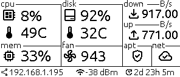
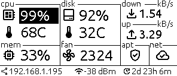

# SysInk

A lightweight system monitor for Raspberry Pi with Waveshare e-Paper display, written in Zig.

## Features

- **Real-time Monitoring**: CPU load, temperature, memory usage, disk usage, fan speed.
- **Network Stats**: IP address, signal strength (WiFi), upload/download speeds.
- **System Info**: Uptime, APT updates availability, Internet connection status.
- **Hardware Health**: Under-voltage and NVMe SMART critical warnings — shown as an
  inverted status bar on the panel and published over MQTT as problem entities.
- **Optimized Rendering**: Partial updates for e-Paper display to minimize flickering and maximize refresh rate.
- **Home Assistant**: Optional MQTT publishing with auto-discovery.
- **Notices**: Any program can put a short message on the panel for a while,
  through a named pipe locally, or an MQTT topic or the HTTP API from anywhere
  on the network.
- **HTTP API**: Current readings as JSON, and notices with a bearer token,
  served beside the optional panel preview.
- **Standalone**: Statically linked binary (using musl), easy to deploy on any distro.

## Screenshots

| Main Screen | Loading Screen |
|:-----------:|:--------------:|
|  |  |

| Sleep Screen | Threshold Alert |
|:------------:|:---------------:|
|  |  |

## Hardware Requirements

- **Raspberry Pi**: Tested on Pi 5; uses the modern Linux GPIO character device
  API (`/dev/gpiochip*`), including the Pi 5's RP1 chip. Older models may work —
  `armhf` builds are published and target ARMv6, so they also run on the Pi
  Zero, Zero W and Pi 1 — but are untested.
- **Display**: [Waveshare 2.9inch e-Paper Module (B/W) V2](https://www.waveshare.com/wiki/2.9inch_e-Paper_Module).
  - *Note: This project is specifically tuned for the V2 version of the display.*
- **Connections**: SPI interface and GPIO pins (RST, DC, BUSY, PWR).

## Development

You can develop and test the UI logic on a non-Raspberry Pi machine (e.g., x86_64 Linux) by using the BMP export feature. This allows you to visualize what would be sent to the display without the actual hardware.

1. **Build the project**:
   ```bash
   zig build
   ```

2. **Run with BMP export enabled**:
   ```bash
   EXPORT_BMP=true BMP_EXPORT_PATH=/tmp/display.bmp ./zig-out/bin/sys-ink
   ```

3. **View the output**:
   Open `/tmp/display.bmp` in an image viewer. It will update whenever the display would update.

### Tests

Parsing, layout, rendering, the panel driver, the MQTT protocol and the HTTP
API's request reading, routing and token check are covered by unit tests that run on any host — the driver and renderer are generic over
their transport, so their command sequences are checked against a recorder
rather than a panel:

```bash
zig build test --summary all
```

On Linux the same command also runs the daemon's HTTP server on a loopback
port and talks to it as a client would, and reads notices through a real named
pipe. Neither needs a panel, but both make Linux system calls, so other hosts
leave them out.

The remaining hardware-facing modules only compile for Linux, so they are
type-checked separately:

```bash
zig build check
```

The renderer has a golden-image test: it draws a screen with fixed values and
compares the packed frame against `src/testdata/golden_main.bin`, which pins the
whole layout at once. After an intentional layout change, regenerate it and
review the diff:

```bash
zig build golden
```

### Panel simulator

The daemon itself only runs on Linux, but the whole rendering path is host-
independent: the renderer is generic over its transport, which is what the
golden test already relies on. The simulator drives that same path against the
recorder and shows the result, so layout work needs no hardware:

```bash
zig build sim
```

On macOS that opens a native window. Elsewhere — and with `zig build sim-web`
anywhere — it serves the frame at <http://127.0.0.1:8390> instead. Both show the
panel magnified 3x with pixels left unsmoothed, and both go through the same
export the daemon uses, so the fault overlay appears exactly as it would on the
glass.

Metrics are synthesized as smooth functions of time, which walks every slot
through its own formatting without anyone driving it: traffic sweeps several
orders of magnitude so each unit appears, the signal reading crosses the width
where it drops its `dBm` suffix, and the fault overlay flares for six seconds
out of every thirty so the inverted status bar can be checked too.

### Regenerating fonts

`src/font_data.zig` is generated by `tools/fontgen.c` (needs cairo and freetype2).
Glyph bitmaps depend on the installed cairo/FreeType versions, and the layout
constants in `src/display_config.zig` are tuned to the checked-in output — diff
carefully before committing a regenerated file.

```bash
gcc -o fontgen $(pkg-config --cflags cairo freetype2) tools/fontgen.c $(pkg-config --libs cairo freetype2) -lm
./fontgen   # writes src/font_data.zig
```

## Project Structure

- `src/main.zig`: Entry point, signal handling, scheduled tasks, main event loop.
- `src/scheduler.zig`: Monotonic-clock task scheduler for periodic updates.
- `src/parse.zig`: I/O-free parsers for procfs/sysfs and command output (unit tested).
- `src/display_renderer.zig`: High-level rendering logic (text, icons, fault overlay).
- `src/display_config.zig`: Layout constants and configuration.
- `src/graphics.zig`: Bitmap drawing primitives and text rendering.
- `src/font_data.zig`: Generated static glyph tables.
- `src/system_ops.zig`: System metrics collection (CPU, RAM, disk, SMART, under-voltage).
- `src/gpio_native.zig`: GPIO character device access (v2 ABI).
- `src/bounded_connect.zig`: TCP connect and send-buffer wait with a deadline,
  shared by MQTT and the reachability probe until `std` implements
  `ConnectOptions.timeout`.
- `src/network_ops.zig`: Network status and traffic monitoring.
- `src/mqtt.zig`: MQTT 3.1.1 client and Home Assistant discovery.
- `src/notice.zig`, `src/notice_fifo.zig`: notices — reading the payload,
  folding its text to what the fonts can draw, and receiving it through the
  named pipe. MQTT notices arrive through `src/mqtt.zig`, HTTP ones through
  `src/web_preview.zig`.
- `src/bmp.zig`: BMP export for headless preview.
- `src/config.zig`, `src/logger.zig`: Configuration and logging.
- `src/waveshare_epd/`: Low-level driver for the e-Paper display, generic over its
  transport; `fake_transport.zig` is the recorder the tests drive it with.
- `src/syscall.zig`: Interpreting raw Linux syscall returns (see the module comment).
- `src/tests.zig`, `src/golden_gen.zig`: test root and the golden-frame generator.
- `src/web_preview.zig`: optional HTTP view of the current frame and the API,
  off by default.
- `src/api.zig`, `src/http_request.zig`: the API's routes, token check and
  status JSON, and reading a request — both free of I/O and unit tested.
- `src/frame_server.zig`, `src/viewer_page.html`: the HTTP serving and the
  viewer page, shared by the preview and the simulator.
- `src/sim_frame.zig`: what the simulators draw; the front ends are
  `src/sim_native.zig` (macOS window) and `src/sim_web.zig` (served preview).

## Build Instructions

### Prerequisites

- [Zig Compiler](https://ziglang.org/download/) 0.17.0
- Network access on the first build: `zig build` fetches the
  [translate-c](https://codeberg.org/ziglang/translate-c) package pinned in
  `build.zig.zon`, which turns the libc headers in `src/c.h` into Zig.

### Building for Raspberry Pi (AArch64)

To build a statically linked binary for Raspberry Pi:

```bash
zig build -Dtarget=aarch64-linux-musl -Doptimize=safe
```

The resulting binary will be located at `zig-out/bin/sys-ink`.

`safe` (formerly `ReleaseSafe`) is what the releases are built with: it keeps
the bounds and overflow checks in, so a bug in reading something off the
network ends the daemon — which systemd restarts — instead of corrupting the
memory of a process that runs as root. `small` builds too and is about 200 KB
smaller, without them.

For 32-bit Raspberry Pi OS, name the CPU as well. Zig's default for this
target is ARMv7, which the Pi Zero, Zero W and Pi 1 cannot run; the ARM1176
build below runs on every 32-bit Pi:

```bash
zig build -Dtarget=arm-linux-musleabihf -Dcpu=arm1176jzf_s -Doptimize=safe
```

## Installation

### Option A: APT Repository (Recommended)

The easiest way to install and keep SysInk updated is using our APT repository.

1. **Add the signing key and repository**:
   ```bash
   sudo mkdir -p /etc/apt/keyrings
   sudo curl -fsSL -o /etc/apt/keyrings/sys-ink.gpg https://zales.github.io/sys-ink/sys-ink-archive-keyring.gpg
   echo "deb [signed-by=/etc/apt/keyrings/sys-ink.gpg] https://zales.github.io/sys-ink/ ./" | sudo tee /etc/apt/sources.list.d/sys-ink.list
   ```

   The repository is signed. You can check the key you just installed against
   the published fingerprint:

   ```bash
   gpg --show-keys /etc/apt/keyrings/sys-ink.gpg
   # C834 8411 213F 794E 2773  8104 82A9 AAFF 9189 5891
   ```

   > **Upgrading from an unsigned install.** Releases before 1.5.0 were
   > published unsigned, and the instructions asked for `[trusted=yes]`, which
   > disables package authentication entirely. Run the two commands above to
   > replace that line; `apt` will then verify what it downloads.

2. **Update and Install**:
   ```bash
   sudo apt update
   sudo apt install sys-ink
   ```

   The service will start automatically after installation.

### Option B: Debian Package (.deb)

1. **Download the `.deb` package** for your architecture (`arm64` for 64-bit Raspberry Pi OS, `armhf` for 32-bit) from the [Releases](https://github.com/zales/sys-ink/releases) page.
2. **Install**:
   ```bash
   sudo dpkg -i sys-ink_*.deb
   ```
   The service will start automatically.

### Option C: Manual Binary Installation

1. **Download the binary** (`sys-ink-aarch64` or `sys-ink-armhf`) from the Releases page.
2. **Transfer to Raspberry Pi**:
   ```bash
   scp sys-ink-aarch64 user@raspberrypi:/usr/local/bin/sys-ink
   ```
3. **Set Permissions**:
   ```bash
   ssh user@raspberrypi
   sudo chmod +x /usr/local/bin/sys-ink
   ```
   Ensure the user running the application is in `gpio` and `spi` groups.

### Systemd Service (Manual Install Only)

The `.deb` packages ship their own unit. If you installed manually, create:

`/etc/systemd/system/sys-ink.service`:

```ini
[Unit]
Description=SysInk Service
After=network-online.target
Wants=network-online.target

[Service]
ExecStart=/usr/local/bin/sys-ink
Restart=always
RestartSec=5
User=root
EnvironmentFile=-/etc/default/sys-ink
NoNewPrivileges=yes
ProtectHome=yes
ProtectKernelTunables=yes
ProtectKernelModules=yes
ProtectKernelLogs=yes
ProtectControlGroups=yes
RestrictSUIDSGID=yes
RestrictRealtime=yes
LockPersonality=yes
RuntimeDirectory=sys-ink

[Install]
WantedBy=multi-user.target
```

Enable and start the service:

```bash
sudo systemctl enable --now sys-ink
```

The hardening lines are the ones the `.deb` unit uses. They leave the devices,
`/var` and `/tmp` reachable, which the panel, the APT check and the BMP export
need, and close off home directories and the kernel's tunables. With
`ProtectHome`, `BMP_EXPORT_PATH` and `LOG_FILE_PATH` cannot point into `/home`
or `/root`. `systemd-analyze security sys-ink` shows what is left open.
`RuntimeDirectory` gives the notice pipe its `/run/sys-ink` and removes it when
the service stops.

## Configuration

The application is configured via environment variables. The `.deb` package reads
them from `/etc/default/sys-ink`; otherwise set them in the unit file or export
them before running.

### Hardware

| Variable | Default | Description |
|----------|---------|-------------|
| `GPIO_CHIP` | auto-detected | Path to GPIO chip device. Auto-detected from known `pinctrl` chip labels, falling back to `/dev/gpiochip0`. Check with `gpiodetect`. |
| `SPI_DEVICE` | `/dev/spidev0.0` | Path to SPI device |

### Intervals

| Variable | Default | Description |
|----------|---------|-------------|
| `INTERVAL_FAST` | `30` | Seconds between CPU/memory/disk/fan/traffic/uptime/IP updates and display refreshes |
| `INTERVAL_SLOW` | `10800` | Seconds between APT and internet-reachability checks (3 hours). With MQTT enabled the reachability probe also runs for Home Assistant, at most once a minute, and the panel shows the newest result |
| `INTERVAL_FULL_REFRESH` | `600` | Seconds between full panel refreshes, which clear the ghosting left by partial updates. A full refresh flashes the panel by design; raise this if that bothers you, at the cost of more accumulated ghosting |

Network rates use decimal units: `kB` is 1000 bytes, matching the SI prefix and
the convention for throughput. Releases before 1.5.0 divided by 1024 while
labelling the result `kB`, so displayed and published rates were 2.4% lower than
the unit claimed.

Only interfaces backed by hardware — Ethernet, Wi-Fi, USB adapters — are
counted. Bridges, veth pairs and VPN tunnels carry the same bytes a second
time, so on a host running Docker every container's traffic used to be
counted two or three times over. Where no interface has a device, as inside
a container, all of them are summed as before.

### Panel power

| Variable | Default | Description |
|----------|---------|-------------|
| `PANEL_SLEEP` | `true` | Park the panel in deep sleep between refreshes instead of leaving it driven continuously, which Waveshare advises against. Cycles where nothing changed then cost nothing at all. Adds roughly 200 ms to each visible update, and does not add any flashing — waking is done without driving the panel. Set to `false` to keep the controller powered. |

Waking from deep sleep loses the reference frame that partial updates are
rendered against, so it is restored from the frame the daemon knows is on the
glass. That restore only takes effect if it happens before the partial update
sequence powers the analog stage up; see `primeBase` in
`src/waveshare_epd/epd2in9.zig`. Getting this wrong smears the previous
content rather than failing outright, which is why it is spelled out here.

### Thresholds

Values at or above these are rendered inverted.

| Variable | Default | Description |
|----------|---------|-------------|
| `THRESHOLD_CPU_CRITICAL` | `90` | CPU load critical threshold (%) |
| `THRESHOLD_TEMP_CRITICAL` | `85` | CPU and disk temperature critical threshold (°C) |
| `THRESHOLD_MEM_CRITICAL` | `95` | Memory usage critical threshold (%) |
| `THRESHOLD_DISK_CRITICAL` | `95` | Disk usage critical threshold (%) |

### Internet check

| Variable | Default | Description |
|----------|---------|-------------|
| `INTERNET_CHECK_IP` | `8.8.8.8` | IPv4 address probed with a 1-second TCP connect |
| `INTERNET_CHECK_PORT` | `53` | Port for the probe |

### Panel preview

The running daemon can serve the frame currently on the panel, which is the only
way to see it on a machine you are not standing next to.

| Variable | Default | Description |
|----------|---------|-------------|
| `WEB_PREVIEW` | `false` | Serve the current frame over HTTP, and the [HTTP API](#http-api) beside it |
| `WEB_PREVIEW_ADDR` | `127.0.0.1` | Address to bind |
| `WEB_PREVIEW_PORT` | `8390` | Port to bind |

What it serves is the frame the daemon drew, not a re-render, so it agrees with
the glass including the fault overlay.

> **It has no authentication,** and the frame shows the host's address, load and
> disk figures. It binds loopback, so viewing it from elsewhere means a tunnel:
>
> ```bash
> ssh -L 8390:127.0.0.1:8390 user@raspberrypi
> ```
>
> `WEB_PREVIEW_ADDR=0.0.0.0` puts it on the network for anyone who can reach the
> port. Set that only on a network where that is acceptable.

Reading the request carries a two-second deadline, so a client that connects and
then says nothing costs one pause rather than taking the preview down — which is
what used to happen. Writes have no deadline of their own and need none: a
response is a few kilobytes and fits the socket's send buffer whole, so it never
waits on a client that has stopped reading. Failed accepts back off instead of
spinning.

One connection is served at a time, which is ample for a page fetching one image
a second but does mean many simultaneous stalled connections slow it down, each
for up to its deadline. Nothing recovers from that but waiting, so treat the
preview as a diagnostic aid on a network you trust rather than a service to
expose.

### HTTP API

The preview's server also answers a small API, so it is on whenever
`WEB_PREVIEW` is. [`docs/openapi.yaml`](docs/openapi.yaml) describes it in
full as an OpenAPI 3.1 document.

| Method | Path | What it does |
|--------|------|--------------|
| `GET` | `/api/status` | The latest readings as JSON |
| `POST` | `/api/notice` | Put a notice on the panel; needs the token |
| `DELETE` | `/api/notice` | Take the notice on show down early; needs the token |

| Variable | Default | Description |
|----------|---------|-------------|
| `WEB_API_TOKEN` | unset | Bearer token for the notice routes. Unset leaves them shut |

```bash
curl -s http://127.0.0.1:8390/api/status
```

```json
{"cpu_load":12,"cpu_temp":48,"memory":31,"disk_usage":67,"disk_temp":null,
 "fan_speed":2100,"uptime_minutes":4445,"ip_address":"192.168.1.20","wired":true,
 "signal_strength":null,"internet":true,"download_bytes_per_second":1250000,
 "upload_bytes_per_second":0,"apt_updates":3,"undervoltage":false,
 "nvme_fault":null,"ssd_wear":2}
```

The readings are the ones the panel was last drawn from, taken every
`INTERVAL_FAST` seconds; asking more often returns the same numbers. Units are
percent, °C, RPM, dBm and bytes per second. `null` means not known — no such
sensor on this hardware, or no reading yet — never zero standing in for one.
CPU load and temperature, memory and disk usage are the exception: every
machine has them, so they are always numbers, and a read that fails keeps the
previous value. Names follow the MQTT topics where there is one, except
traffic: MQTT publishes `traffic_down` and `traffic_up` in kB/s, the API
`download_bytes_per_second` and `upload_bytes_per_second` in bytes per second.

A notice takes the same body as the pipe and MQTT, plain text or JSON (see
[Notices](#notices)):

```bash
curl -H "Authorization: Bearer $TOKEN" -d 'Backup finished' http://127.0.0.1:8390/api/notice
curl -H "Authorization: Bearer $TOKEN" -d '{"text": "Deploy running", "duration": 300}' http://127.0.0.1:8390/api/notice
curl -H "Authorization: Bearer $TOKEN" -X DELETE http://127.0.0.1:8390/api/notice
```

| Answer | When |
|--------|------|
| `202` | Accepted; it is on the panel within a moment |
| `400` | Nothing visible in the text, or a malformed request |
| `401` | Token missing or wrong |
| `403` | No `WEB_API_TOKEN` configured, or `NOTIFY_ENABLED=false` |
| `411` | A chunked body; send `Content-Length`, as `curl -d` does |
| `413` | Body over 4 KB |

- **Reading is as open as the preview.** `/api/status` shows nothing the frame
  does not, so it needs no token, and the loopback default applies to it too.
- **Writing is shut until you choose a token.** Listening on a port is not a
  decision to let whoever reaches it write on the panel. Pick a long random
  one, e.g. `openssl rand -hex 32`, and keep it where only root can read it.
  The `.deb` ships `/etc/default/sys-ink` as mode 0640, so it can go there;
  on a manual install, or if you have loosened that file, use a root-only
  environment file as for the
  [MQTT password](#mqtt--home-assistant-integration). The daemon withholds it
  from the commands it runs, as it does the MQTT password.
- **The token travels in clear.** There is no TLS. On loopback or through the
  SSH tunnel that does not matter; with `WEB_PREVIEW_ADDR=0.0.0.0` anyone who
  can watch the network can read it, so only open the API up on a network you
  trust, or put a TLS-terminating proxy in front.
- **A notice sent over HTTP is not queued.** Like the other sources, a newer
  one replaces the one waiting or on show.

#### Behind a reverse proxy

To reach the preview and the API from elsewhere with TLS, leave the daemon on
loopback and put a proxy on the same host in front of it. The viewer page
fetches `frame.bmp` by a relative URL, so it works under a path prefix as well
as at the root. The proxy has to pass `Authorization` through, which nginx and
Caddy do by default. With nginx:

```nginx
# In the http block: a notice a second from any one address.
limit_req_zone $binary_remote_addr zone=sysink_notice:1m rate=1r/s;

# The preview and /api/status take no token, so say here who may see them.
location /sysink/ {
    allow 192.168.0.0/16;
    deny all;
    proxy_pass http://127.0.0.1:8390/;
}

# Notices carry a token of their own, so this may reach further than the rest.
location = /sysink/api/notice {
    limit_req zone=sysink_notice burst=5 nodelay;
    proxy_pass http://127.0.0.1:8390/api/notice;
}
```

The preview and `/api/status` need no token. Without the `allow` and `deny`
they are as open as the proxy is, and tell whoever asks the machine's address
on its own network, how long it has been up and how many updates it is behind;
leave them out only if that is what you mean. The limit on the notice route is
what stops a token being guessed at speed, since the daemon keeps no count of
failed attempts.

### Notices

Other programs can show a message on the panel. It replaces the dashboard for
`NOTIFY_DURATION` seconds and then the dashboard comes back, readings current,
with a full refresh to clear the large text's ghost.

On the machine itself, write to the pipe:

```bash
echo "Backup finished" > /run/sys-ink/notify
```

From anywhere that reaches the broker, with MQTT enabled, publish to
`<MQTT_TOPIC_PREFIX>/notify`:

```bash
mosquitto_pub -h broker -t sysink/notify -m "Backup finished"
```

With `WEB_PREVIEW` on and a `WEB_API_TOKEN` set, `POST` it to the
[HTTP API](#http-api):

```bash
curl -H "Authorization: Bearer $TOKEN" -d "Backup finished" http://127.0.0.1:8390/api/notice
```

All three take the same payload: plain text, or JSON when a notice should stay
up longer or shorter than the default:

```bash
mosquitto_pub -t sysink/notify -m '{"text": "Deploy running", "duration": 300}'
```

`message` is accepted for `text`. `duration` is in seconds, at most a day; it
may be a fraction or a number in a string, and zero, a negative number or
leaving it out means `NOTIFY_DURATION`. `{"text": ""}` takes the notice on show
down early. Plain text with nothing visible in it, only spaces or control
characters, is ignored rather than shown as a blank panel.

| Variable | Default | Description |
|----------|---------|-------------|
| `NOTIFY_ENABLED` | `true` | Accept notices: create the pipe, subscribe to the MQTT topic when MQTT is enabled, and open the API's notice routes when it has a token |
| `NOTIFY_FIFO` | `/run/sys-ink/notify` | Path of the pipe. Its directory is created if missing; nothing above it is |
| `NOTIFY_GROUP` | unset | Group allowed to write besides root. Unset leaves the pipe root-only |
| `NOTIFY_DURATION` | `30` | Seconds a notice stays up |

- **A newer notice replaces the one on show** and restarts its timer.
- **On the pipe, one line is one notice.** The line ends at a newline or at the
  end of the write, so `printf` works as well as `echo`. A JSON notice may be
  spread over several lines, as `jq` prints it.
- **A hardware fault still shows.** The inverted status bar for under-voltage
  or a SMART warning is drawn over a notice too, however long it stays up.
- **Text is set in the largest font that fits,** from one large line down to
  six small ones. Longer text is cut off with `...`; about 250 characters is the
  most the panel holds.
- **The fonts cover ASCII only.** Diacritics are dropped (`Příliš žluťoučký`
  shows as `Prilis zlutoucky`), typographic quotes and dashes become their ASCII
  lookalikes, and anything else, emoji included, shows as `?`.
- **Who may write** is decided by the pipe's permissions: `0600` root-only by
  default, `0620` with `NOTIFY_GROUP` set. To let a program running as an
  ordinary user post notices, put that user in a group and name it:

  ```bash
  sudo groupadd -f sysink-notify
  sudo usermod -aG sysink-notify hermes
  echo 'NOTIFY_GROUP=sysink-notify' | sudo tee -a /etc/default/sys-ink
  sudo systemctl restart sys-ink
  ```

- **A writer blocks while nothing reads.** Opening a pipe for writing waits for
  a reader. Under the packaged unit the directory disappears when the service
  stops, so the write fails at once instead; when running the daemon by hand
  the pipe stays behind, and a sender that must never hang should bound it:
  `timeout 2 sh -c 'echo "..." > /run/sys-ink/notify'`.

- **Over MQTT, retained notices are ignored.** A retained message is replayed
  to every new subscriber, which would bring an old notice back each time the
  daemon reconnects. Publish without `-r`. An empty message is ignored as well:
  it is what clearing a retained one (`mosquitto_pub -r -n`) delivers. Who may publish is up to the
  broker's ACL; anyone who can write to the topic can put text on the panel.
- **Over MQTT, notices arrive only while connected.** One sent while the
  daemon is reconnecting is lost, since the subscription is QoS 0 on a clean
  session: a notice shown late is worse than one not shown. A broker that
  vanishes without closing the connection is noticed by TCP keepalive within
  about a minute and a half, and the daemon reconnects and subscribes again.

#### From Home Assistant

With discovery on, the device gains a notify entity, `notify.sysink_panel`,
that publishes to the notice topic. An automation can then put a notice on the
panel like any other notification:

```yaml
action: notify.send_message
target:
  entity_id: notify.sysink_panel
data:
  message: "Washing machine finished"
```

Home Assistant names the entity after the device and its area, so a panel
assigned to an area gets that prefix, e.g. `notify.office_sysink_panel`; the
actual ID is under Settings → Devices & Services → MQTT → SysInk. Turning
notices off with `NOTIFY_ENABLED=false` removes the entity again.

#### From an AI agent

[`examples/hermes/sysink-panel`](examples/hermes/sysink-panel) is a skill for
[Hermes Agent](https://hermes-agent.nousresearch.com/): when to use the panel
and when not (it is readable by anyone in the room), how short to keep the
text, and a helper script that writes to the pipe or falls back to MQTT.
Install it with:

```bash
cp -r examples/hermes/sysink-panel ~/.hermes/skills/
```

An agent whose commands run in a sandbox container cannot see the pipe, so
the helper falls back to MQTT: with a standard-library Python publisher, which
keeps the password out of the process list, or `mosquitto_pub` where there is
no Python, reaching the host's broker
through the container's gateway. Give it credentials in `sysink.env` next to
`SKILL.md`, readable only by you:

```bash
cat > ~/.hermes/skills/sysink-panel/sysink.env <<'ENV'
SYSINK_MQTT_USER=hermes
SYSINK_MQTT_PASSWORD=...
ENV
chmod 600 ~/.hermes/skills/sysink-panel/sysink.env
```

`SYSINK_MQTT_HOST`, `SYSINK_MQTT_PORT` and `SYSINK_MQTT_TOPIC` go there too if
the defaults do not fit. A broker user of its own for the agent is better than
sharing Home Assistant's, and a broker ACL can limit it to the notice topic.

The skill follows the [agentskills.io](https://agentskills.io) format, so other
agents that read `SKILL.md` skills can use it too; the helper,
`scripts/notify.sh`, works on its own as well.

### Logging and export

| Variable | Default | Description |
|----------|---------|-------------|
| `LOG_LEVEL` | `INFO` | `DEBUG`, `INFO`, `WARN` (or `WARNING`) or `ERROR` |
| `LOG_TO_FILE` | `false` | Also write log records to a file |
| `LOG_FILE_PATH` | `/var/log/sys-ink.log` | Log file path, appended to. Lines carry a UTC date and time. The `.deb` rotates the default path weekly through logrotate. If the file cannot be opened, logging continues on stderr |
| `EXPORT_BMP` | `false` | Enable BMP export for web debugging |
| `BMP_EXPORT_PATH` | `/tmp/sys-ink.bmp` | Path for exported BMP |

Boolean variables accept `1`, `true`, `yes` or `on` (case-insensitive); anything else is false.

### MQTT / Home Assistant Integration

SysInk can publish metrics to an MQTT broker for Home Assistant integration with auto-discovery support.

| Variable | Default | Description |
|----------|---------|-------------|
| `MQTT_ENABLED` | `false` | Enable MQTT publishing |
| `MQTT_HOST` | `localhost` | MQTT broker hostname (DNS, mDNS `.local` and `/etc/hosts` all work) |
| `MQTT_PORT` | `1883` | MQTT broker port |
| `MQTT_USERNAME` | (none) | MQTT username (optional) |
| `MQTT_PASSWORD` | (none) | MQTT password (optional) |
| `MQTT_CLIENT_ID` | `sysink` | MQTT client identifier, and the device's identity in Home Assistant |
| `MQTT_TOPIC_PREFIX` | same as `MQTT_CLIENT_ID` | Topic prefix for all messages |
| `MQTT_DISCOVERY` | `true` | Enable Home Assistant auto-discovery |

Discovery configs are republished on every successful connection, so the device
appears in Home Assistant even when the broker was unreachable at boot.

**More than one panel:** give each its own `MQTT_CLIENT_ID`. The discovery topics,
the entities' unique IDs and the device all derive from it, and the topic prefix
follows it unless set, so that one variable is enough. The default `sysink`
derives exactly what earlier releases published, so a single existing panel
keeps its entities.

Entities go unavailable in Home Assistant after three `INTERVAL_FAST` periods
without an update, so a panel that is switched off does not keep showing its last
readings as current. The same applies to readings the daemon withholds on
purpose: an IP address that is gone, a disk temperature or fan the hardware does
not have. Numeric sensors carry `state_class: measurement`, so Home Assistant
keeps long-term statistics for them.

**Storing the password:** avoid `Environment=MQTT_PASSWORD=...` in a unit file —
it is readable by any local user via `systemctl show sys-ink`. Prefer a
root-only environment file:

```bash
sudo install -m 600 /dev/null /etc/sys-ink/mqtt.env
sudo tee /etc/sys-ink/mqtt.env >/dev/null <<'EOF'
MQTT_ENABLED=true
MQTT_HOST=192.168.1.100
MQTT_USERNAME=homeassistant
MQTT_PASSWORD=secret
EOF
sudo systemctl edit sys-ink
```

Add:
```ini
[Service]
EnvironmentFile=/etc/sys-ink/mqtt.env
```

After enabling MQTT, sensors will automatically appear in Home Assistant under
the "SysInk" device — the metrics shown on the panel plus SSD wear, and two
problem entities (`Under-voltage`, `NVMe SMART Fault`) that Home Assistant can
turn into notifications. SMART reading needs the daemon to run as root, which
the packaged service does; unprivileged runs disable it silently.

The device goes **unavailable** in Home Assistant as soon as the daemon stops:
it publishes `offline` to `<MQTT_TOPIC_PREFIX>/status` on a clean shutdown, and
the broker publishes the same as its Last Will after a crash or `kill -9`. A Pi
that loses power sends nothing, so there the entities time out after three
`INTERVAL_FAST` periods instead.

A ready-made dashboard showing all of it is provided in
[`examples/home-assistant/dashboard.yaml`](examples/home-assistant/dashboard.yaml)
— paste it into a new dashboard's raw configuration editor. The file explains
how, and what to check if your entity IDs differ.

## Troubleshooting

### "Failed to initialize display"
- Ensure SPI is enabled (`sudo raspi-config` -> Interface Options -> SPI).
- Check wiring connections.
- Verify the user has permissions to access `/dev/spidev0.0` and `/dev/gpiochip*`.
  - Add user to groups: `sudo usermod -a -G spi,gpio <username>`
- Run with `LOG_LEVEL=DEBUG` — the SPI and GPIO failures name the device path and errno.

### Display not updating or showing garbage
- Ensure you have the **V2** version of the Waveshare 2.9" display. V1 uses different LUTs and commands.
- Check if the display is correctly seated in the HAT or if wires are loose.
- Persistent ghosting means full refreshes are too rare; lower `INTERVAL_FULL_REFRESH`.

### "Memory leak detected on exit!"
- This is a warning from the Zig allocator in debug/release-safe modes. It usually indicates a clean shutdown didn't happen (e.g., `kill -9`). Use `Ctrl+C`, `SIGTERM` or `systemctl stop` for a graceful shutdown, which also parks the panel in deep sleep.

## Changelog

See [CHANGELOG.md](CHANGELOG.md). Breaking changes are listed in a table at the
top — most recently, in 1.8.0, the Home Assistant discovery identity following
`MQTT_CLIENT_ID`, which matters only if you changed it from the default.

## License

MIT — see [LICENSE](LICENSE).
